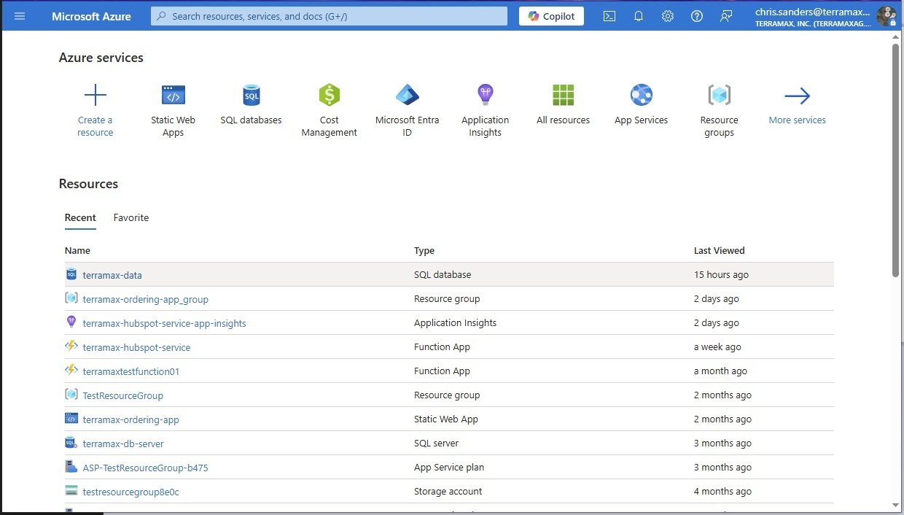

# Azure Overview

Azure is a cloud platform owned by Microsoft that offers a variety of
online resources. TerraMax has a single Azure account which, thought not
part of the TerraMax Microsoft 365 account, uses the same **tenant id**.
This means that both accounts are part of the same organization, share
access to user identities and security settings, and are both managed
through **Microsoft Entra**.

This project uses Azure to host several components in a secure and
centralized way, allowing them to share the same security
infrastructure. They can be viewed and managed through the **Azure
Portal**.

------------------------------------------------------------------------

## Azure Portal

When logged in to the home page, you should see a row of icons of Azure
Services, like *Static Web Apps* and *Azure Functions*, and below that a
list of current resources.

Most of the icons in the row of Services will take you to a page that
displays all current resources of the service type. You can also create
new recources, either within the page dedicated to the specific type, or
by clicking on the `Create a resource` plus sign button in the home
screen.

Other services of note in the top row are:

- **Microsoft Entra**: manages identity across all accounts within the
  TerraMax organization. The `App Registration` section is important for
  managing security and communication between the Ordering App and
  HubSpot Service.

- **Cost Management**: lets you view the current and predicted costs of
  various resources, set spending limits, and set warnings for when
  those limits are reached.

Below the row of services, you should see a list of current resouces.

## Project-Specific Resources

Core components of this project include:

- **Ordering App**
  ([`terramax-ordering-app`](ordering-app/ordering-app-overview.md)): a
  user-facing web app that users can directly interact with to submit
  and manage Deals in HubSpot.
  - Hosted in **Azure Static Web Apps**
  - Written in **React + Typescript**
  - Uses **Microsoft Entra ID authentication** via MSAL, allowing only
    TerraMax users to log in
- **HubSpot Service** (`terramax-hubspot-service`): a backend API that
  connects the Ordering App to both an internal product database, and
  HubSpot’s records of customers and sales.
  - Hosted in **Azure Functions**
  - Written in **Typescript**
  - Uses **Microsoft Entra ID** to validate incoming requests and
    restrict access to approved applications
- **TerraMax Data** (`terramax-data`): a SQL database that holds the
  masterlist of product information, and a log of transactions that have
  passed through the server app.
  - Hosted in **Azure SQL database**
  - Accessed only through the server app, not directly by the client

Other relevant resources:

- `terramax-hubspot-service-app-insights`
  - Application Insights instance connected to the
    `terramax-hubspot-service`Function App, which logs data about the
    app’s use.
- `terramax-db-server`
  - Logical SQL Server that contains the `terramax-data` database. Azure
    requires a server to exist, even if it only hosts a single DB.
- `TestResourceGroup`
  - The main Resource Group that contains all parts of the project in
    Azure. The name comes from its origin during the beginning phase of
    the project, but to rename and restructure would require recreating
    resources.
- `ASP-TestResourceGroup-b475`
  - The App Service Plan associated with the Function App
    `terramax-hubspot-service`. It defines the underlying compute
    environment, and was auto-generated (and named) by Azure.
- `testresourcegroup8e0c`
  - The storage account automatically created to support the Function
    App `terramax-hubspot-service`, used for things like
- `ordering-app_group`
  - An organizational group that Azure auto-generated, not structurally
    important. It overlaps imperfectly with the `TestResourceGroup`
